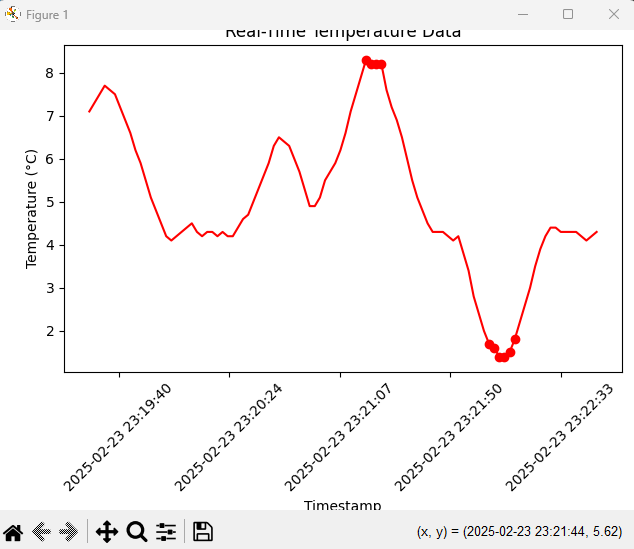

# buzzline-06-hudson

This project shows how streaming data can be consumed and visualized using a Kafka pipeline.

The data is time and temperature data that could be encountered in various industries and applications. The Kafka producer takes data from a .csv file and writes it to a Kafka topic. The consumer plots the time and temperature data from the Kafka topic and plots then on a line chart. There is an alert if the temperature is less than 2.0C or greater then 8.0C.

Task 1. Use Tools from Module 1 and 2
Before starting, ensure you have completed the setup tasks in https://github.com/denisecase/buzzline-01-case and https://github.com/denisecase/buzzline-02-case first. Python 3.11 is required.

Task 2. Copy This Example Project and Rename
Once the tools are installed, copy/fork this project into your GitHub account and create your own version of this project to run and experiment with. Name it buzzline-03-yourname where yourname is something unique to you. Follow the instructions in FORK-THIS-REPO.md.

Task 3. Manage Local Project Virtual Environment
Follow the instructions in MANAGE-VENV.md to:

Create your .venv
Activate .venv
Install the required dependencies using requirements.txt.

Task 4. Start Zookeeper and Kafka (2 Terminals)
If Zookeeper and Kafka are not already running, you'll need to restart them. See instructions at [SETUP-KAFKA.md] to:

Start Zookeeper Service (link)
Start Kafka (link) 

Task 5. Start a the Project Producer
In VS Code, open a terminal. Use the commands below to activate .venv, and start the producer.

Windows:

.venv\Scripts\activate
py -m producers.project_producer_hudson

Mac/Linux:

source .venv/bin/activate
python3 -m producers.project_producer_hudson

Task 6. Start the Project Consumer
The consumer processes the streaming data in real time.

In VS Code, open a NEW terminal in your root project folder. Use the commands below to activate .venv, and start the consumer.

Windows:

.venv\Scripts\activate
py -m consumers.project_consumer_hudson

Mac/Linux:

source .venv/bin/activate
python3 -m consumers.project_consumer_hudson

